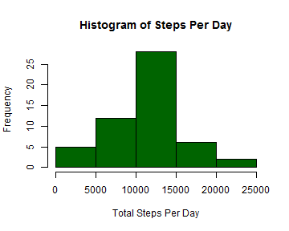
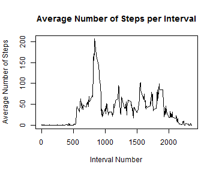
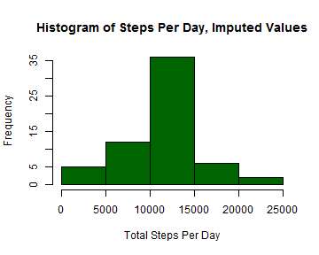
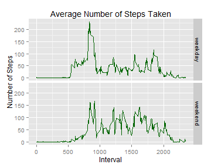

## 1. Loading and preprocessing the data  


```r
pa1data <- read.csv("./activity.csv", stringsAsFactors = FALSE, na.strings = "NA")
pa1data$date <- as.Date(pa1data$date, format="%Y-%m-%d")
```

## 2. What is mean total number of steps taken per day?  
Calculate the total number of steps taken per day  

```r
stepsperday <- aggregate(steps ~ date, data = pa1data, sum)
stepsperday$steps <- as.numeric(stepsperday$steps)
```

Make a histogram of the total number of steps taken each day  

```r
hist(stepsperday$steps, col= "darkgreen", main = "Histogram of Steps Per Day", xlab = "Total Steps Per Day")
```

 
  
Calculate and report the mean and median of the total number of steps taken per day  

```r
mean(stepsperday$steps)
```

```
## [1] 10766.19
```

```r
median(stepsperday$steps)
```

```
## [1] 10765
```
## 3. What is the average daily activity pattern?  
Make a time series plot of the 5-minute interval (x-axis) and the average number of steps taken, averaged across all days (y-axis)  

```r
#Calculate average number of steps per interval across all days
stepsperinterval <- aggregate(steps ~ interval, data = pa1data, mean)
#make a plot
plot(stepsperinterval$interval, stepsperinterval$steps, type = "l", main = "Average Number of Steps per Interval", xlab = "Interval Number", ylab = "Average Number of Steps")
```

 

Which 5-minute interval, on average across all the days in the dataset, contains the maximum number of steps?   

```r
maxint <- subset(stepsperinterval, steps == max(stepsperinterval$steps), interval)
maxint$interval
```

```
## [1] 835
```

Maximum number of steps was taken in the 835 th interval    

## 4. Imputing missing values  
Calculate and report the total number of missing values in the dataset.  

```r
Na <- sum(!complete.cases(pa1data))
Na
```

```
## [1] 2304
```

Devise a strategy for filling in all of the missing values in the dataset.  
Create a new dataset that is equal to the original dataset but with the missing data filled in.  

```r
pa1imp <- cbind(pa1data, stepsperinterval$steps)
colnames(pa1imp)[4] <- "stepsmean"
pa1imp[is.na(pa1imp$steps), "steps"] <- pa1imp[is.na(pa1imp$steps), "stepsmean"]
```

Make a histogram of the total number of steps taken each day   

```r
stepsperdayimp <- aggregate(steps ~ date, data = pa1imp, sum)
stepsperdayimp$steps <- as.numeric(stepsperdayimp$steps)
# Make a histogram of the total number of steps taken each day
hist(stepsperdayimp$steps, col= "darkgreen", main = "Histogram of Steps Per Day, Imputed Values", xlab = "Total Steps Per Day")
```

 
 
Calculate and report the mean and median of the total number of steps taken per day  

```r
mean(stepsperdayimp$steps)
```

```
## [1] 10766.19
```

```r
median(stepsperdayimp$steps)
```

```
## [1] 10766.19
```

Do these values differ from the estimates from the first part of the assignment?  
*Values do not differ a lot.*  
What is the impact of imputing missing data on the estimates of the total daily number of steps?  
*Median became slightlty higher, while mean stays the same. Total number of steps increased.*  

## 5. Are there differences in activity patterns between weekdays and weekends?  
Create a new factor variable in the dataset with two levels - "weekday" and "weekend" indicating whether a given date is a weekday or weekend day.

```r
pa1imp$weekday <- ifelse(grepl('^S', weekdays(pa1imp$date)), "weekend", "weekday")
pa1imp$weekday <- as.factor(pa1imp$weekday)
```
  
Make a panel plot containing a time series plot of the 5-minute interval (x-axis) and the average number of steps taken, averaged across all weekday days or weekend days (y-axis)

```r
#Calculate the number of steps per interval across all weekday days or weekend days
stepsperintwday <- aggregate(steps ~ interval+weekday, data = pa1imp, mean)
```


```r
#Make a plot
library(ggplot2)
g <- ggplot(stepsperintwday, aes(x = interval, y = steps))        
g + geom_line(color="darkgreen") + facet_grid(weekday ~ .) + labs(title = "Average Number of Steps Taken", y = "Number of Steps", x = "Interval")
```

 

